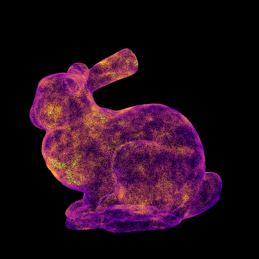
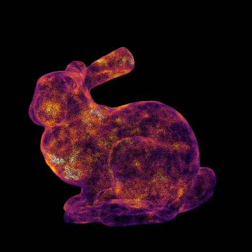

# Visualize Point Density

## Overview
Visualize point density of the point cloud.

## Usage
```
=================================
     Visualize Point Density
         Tomomasa Uchida
           2020/08/21
=================================

  USAGE:
  ./vpd [input.spbr] [output.spbr] [sigma_section_for_outlier] [colormap_option]

  EXAMPLE:
  ./vpd input.ply output.spbr 2 -v

   [sigma_section_for_outlier]
    0: No Outlier
    1: 1σ < Outlier
    2: 2σ < Outlier
    3: 3σ < Outlier

   [colormap_option]
    -v: Viridis
    -p: Plasma
    -i: Inferno
    -m: Magma
    -c: Cividis
```

### Octree
```
PLY Min, Max Coords:
Min : 0.0492606 0.0509949 0.103085
Max : 0.52798 0.525888 0.474338
Number of points: 500000
Diagonal length of BB: 0.769756

ColorMap: Viridis

Set divide value. (search radius = diagonal length / divide value): 100
> search radius: 0.00769756 (= 0.769756/100)

Now Octree Searching... 
Done Octree Search! (0.0599382 [minute])

Min value: 15
Max value: 509
Average: 194.06
Standard Deviation: 64.1714

Removed outliers for point density vector.
New max value: 386

Normalized point density vector.
Updated min and max value.
Min value: 0
Max value: 1

Writing spbr file (SPBR_DATA/test.spbr)...
Done writing spbr file! (0.0190659 [minute])
```

### PCL_RadiusSearch
```
Select search type. (0: RadiusSearch or 1: NearestKSearch): 0
> RadiusSearch

Set divide value. (search_radius = diagonal_length/divide_value): 50000
> search_radius: 0.00349226 (= 174.613/50000)

Now searching and calculating ...
*** Num. of processed points: 1000000 [9.97391 %]
*** Num. of processed points: 2000000 [19.9478 %]
*** Num. of processed points: 3000000 [29.9217 %]
*** Num. of processed points: 4000000 [39.8956 %]
*** Num. of processed points: 5000000 [49.8695 %]
*** Num. of processed points: 6000000 [59.8434 %]
*** Num. of processed points: 7000000 [69.8173 %]
*** Num. of processed points: 8000000 [79.7913 %]
*** Num. of processed points: 9000000 [89.7652 %]
*** Num. of processed points: 10000000 [99.7391 %]
Done! 0.264192 (minute)

Max num of points: 179
Min num of points: 1
Average: 4.25974
SD: 11.9164

Adjusted point densities vector.
Max num of points: 16

Normalized point densities vector.
Max num of points: 1

Writing spbr file (SPBR_DATA/borobu_out.spbr)...
```


### PCL_NearestKSearch
```
Select search type.(0:RadiusSearch or 1:NeatestKSearch) : 1
> NearestKSearch

Set nearest K: 1000
> 1000

Clock start
time : 881.543

Max point density : 0.30644
Min point density : 0.016313
```

## Visualization Results
|Viridis|Plasma|Inferno|Magma|Cividis|
|:-:|:-:|:-:|:-:|:-:|
||||||

|L=1|L=50|L=100|
|:-:|:-:|:-:|
||||

|Ookabuto|Fune-hoko float|Borobudur|
|:-:|:-:|:-:|
||||