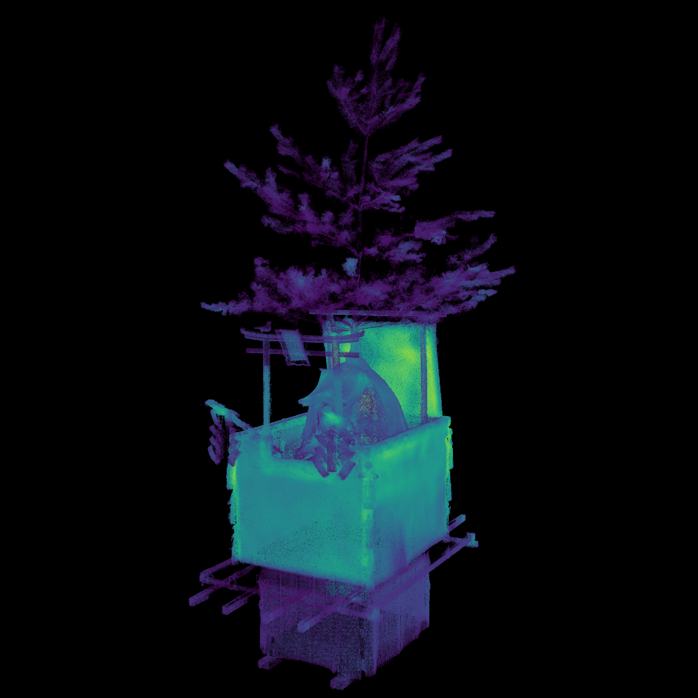
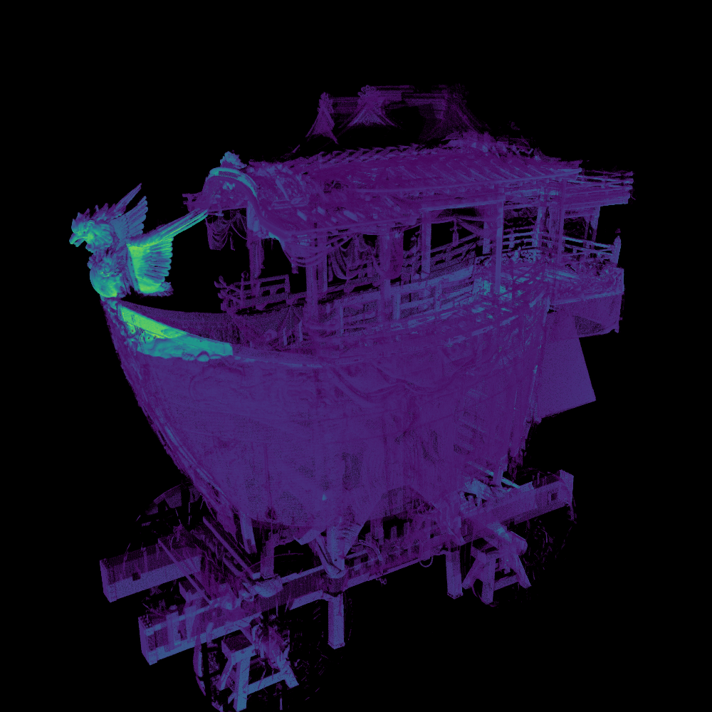
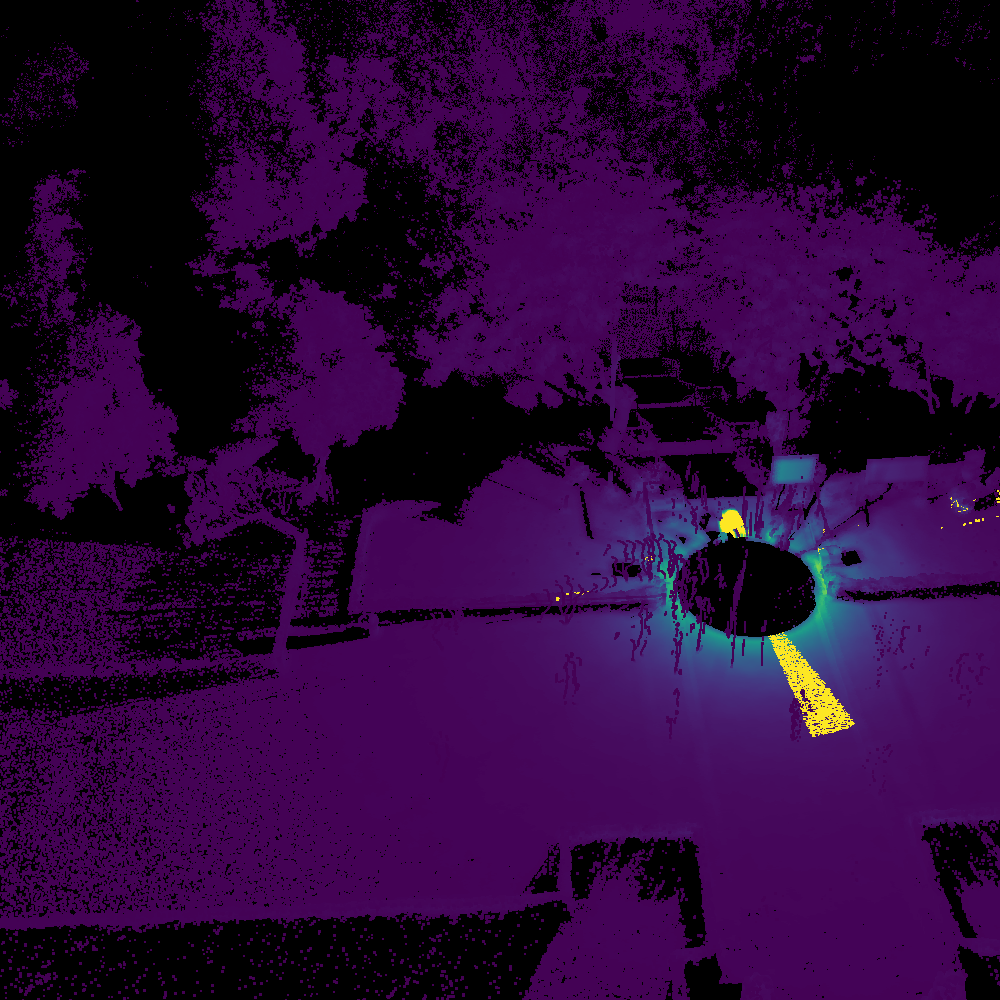

# Visualize Point Density
## Overview
Visualize point density by using colormap "viridis".

## Usage
`./vpd [input_file] [output_file]`

### RadiusSearch
```
Select search type. (0: RadiusSearch or 1: NearestKSearch): 0
> RadiusSearch

Set divide value. (search_radius = diagonal_length/divide_value): 50000
> search_radius: 0.00349226 (= 174.613/50000)

Now searching and calculating ...
*** Num. of processed points: 1000000 [9.97391 %]
*** Num. of processed points: 2000000 [19.9478 %]
*** Num. of processed points: 3000000 [29.9217 %]
*** Num. of processed points: 4000000 [39.8956 %]
*** Num. of processed points: 5000000 [49.8695 %]
*** Num. of processed points: 6000000 [59.8434 %]
*** Num. of processed points: 7000000 [69.8173 %]
*** Num. of processed points: 8000000 [79.7913 %]
*** Num. of processed points: 9000000 [89.7652 %]
*** Num. of processed points: 10000000 [99.7391 %]
Done! 0.264192 (minute)

Max num of points: 179
Min num of points: 1
Average: 4.25974
SD: 11.9164

Adjusted point densities vector.
Max num of points: 16

Normalized point densities vector.
Max num of points: 1

Writing spbr file (SPBR_DATA/borobu_out.spbr)...
```


### NearestKSearch
```
Select search type.(0:RadiusSearch or 1:NeatestKSearch) : 1
> NearestKSearch

Set nearest K: 1000
> 1000

Clock start
time : 881.543

Max point density : 0.30644
Min point density : 0.016313
```

## Result
|八幡山|船鉾|ボロブドゥール寺院|
|:-:|:-:|:-:|
||||