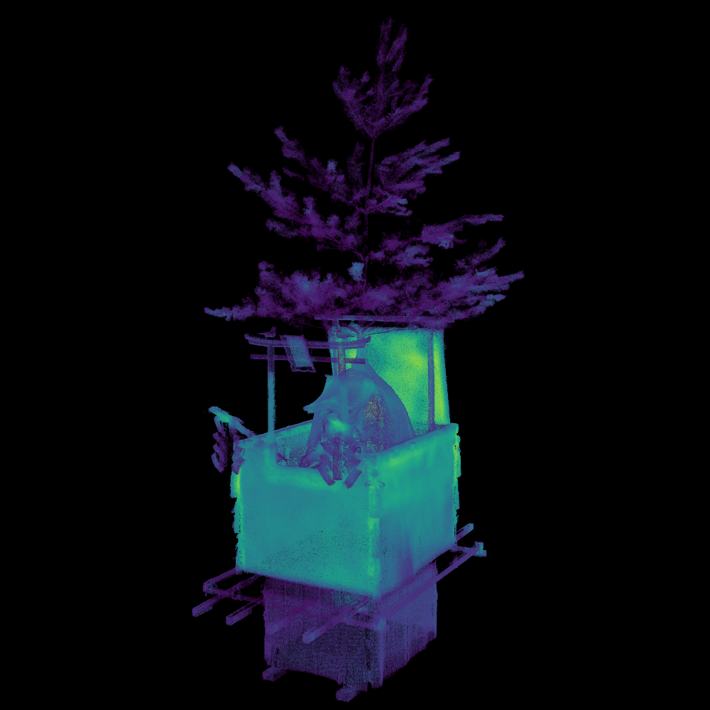

# Visualize Point Density
## Overview
Visualize point density by using colormap "Viridis".



## Usage
`./vpd [input_file] [output_file]`

### 0:RadiusSearch
***
```
Select search type ( 0:RadiusSearch or 1:NeatestKSearch ) : 0
> RadiusSearch

Set divide : 100
> 100

Clock start
time : 3237.54

Max point density : 19175
Min point density : 1
```
***


### 1:NearestKSearch
***
```
Select search type ( 0:RadiusSearch or 1:NeatestKSearch ) : 1
> NearestKSearch

Set nearest K : 1000
> 1000

Clock start
time : 881.543

Max point density : 0.30644
Min point density : 0.016313
```
***