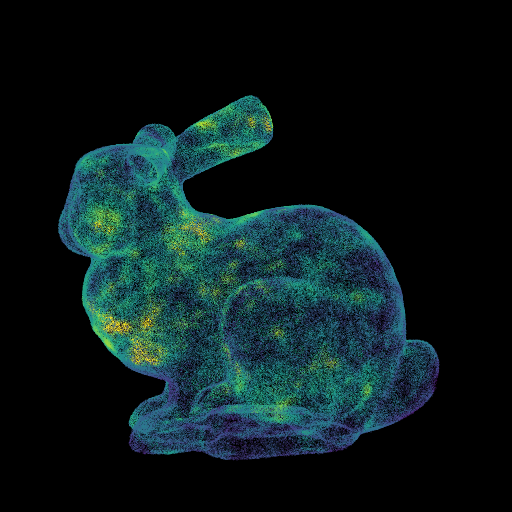
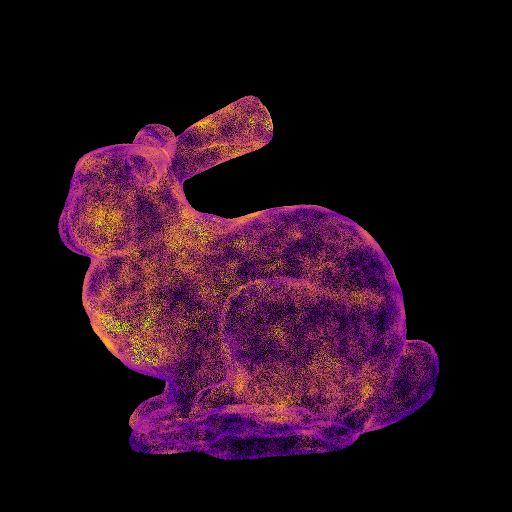
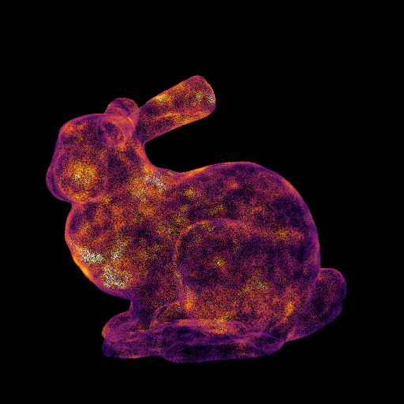
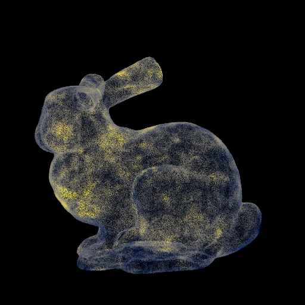
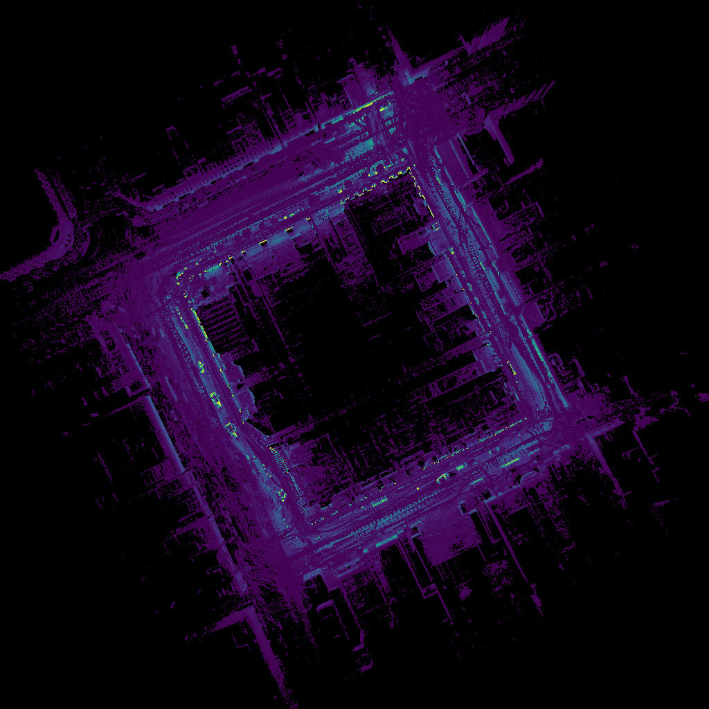
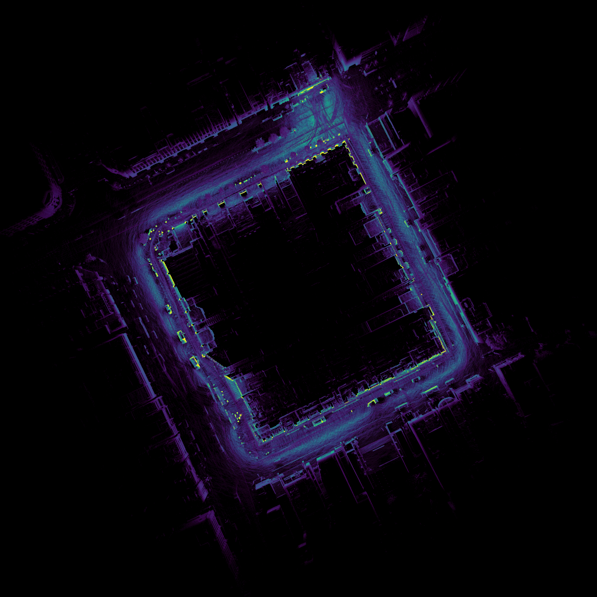
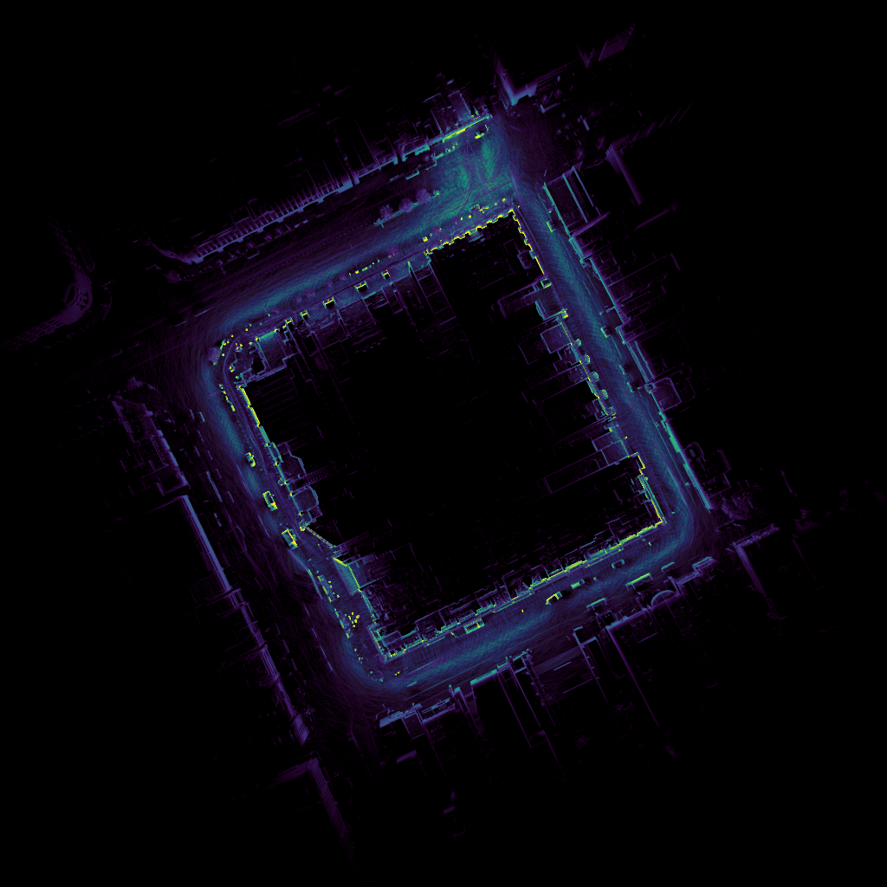
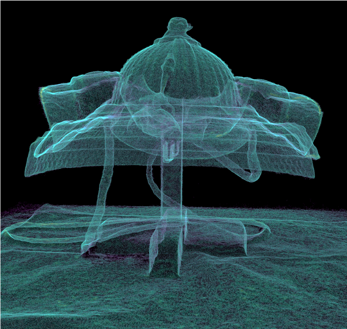
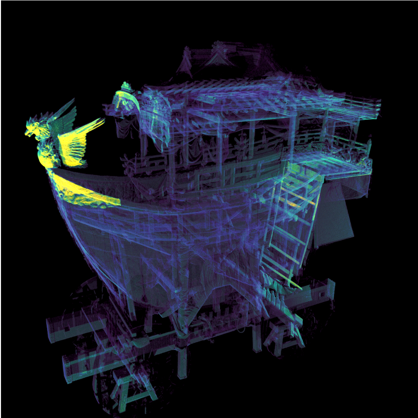
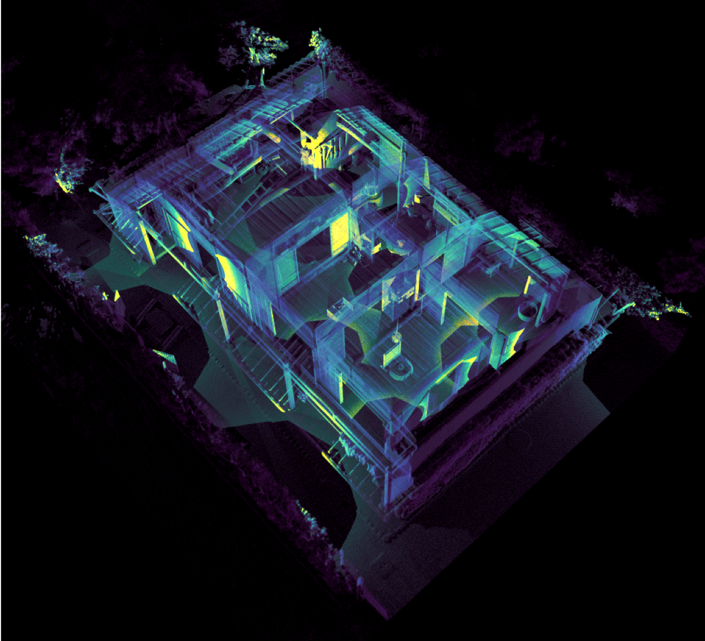

# Visualize Point Density

## Overview
Visualize point density of the point cloud.

## Usage
```
=================================
     Visualize Point Density
         Tomomasa Uchida
           2021/02/06
=================================

  USAGE:
  vpd [input_point_cloud] [output_point_cloud] [sigma_section_for_outlier] [colormap_type]

  EXAMPLE:
  vpd input.ply output.spbr 0 -v

   [sigma_section_for_outlier]
    0: No Outlier
    1: 1σ < Outlier
    2: 2σ < Outlier
    3: 3σ < Outlier

   [colormap_type]
    -v: Viridis
    -p: Plasma
    -i: Inferno
    -m: Magma
    -c: Cividis
```

## Example
```
Bounding Box:
 Min: 0.0492606 0.0509949 0.103085
 Max: 0.52798 0.525888 0.474338

Number of points:
 500018

ColorMap:
 Viridis

Diagonal length of BB:
 0.769756

Input divide value ( search radius = diagonal length / divide value ): 100
 search radius: 0.00769756 ( = 0.769756 / 100 )

Now Octree Searching...
Done Octree search! ( 3.52459 [sec] )

Point density statistics:
 Min: 15
 Max: 509
 Avg: 194.073
 Std: 64.1851

Outliers were removed:
 Threshold: 386

Point densities were normalized:
 Min: 0
 Max: 1

Writing spbr file (./out_viridis.spbr)...
Done writing spbr file! ( 1.19775 [sec] )
```

## Visualization Results
|Viridis|Plasma|Inferno|Magma|Cividis|
|:-:|:-:|:-:|:-:|:-:|
||||||

|L=1|L=50|L=100|
|:-:|:-:|:-:|
||||

|Ookabuto|Fune-hoko float|Borobudur|
|:-:|:-:|:-:|
||||